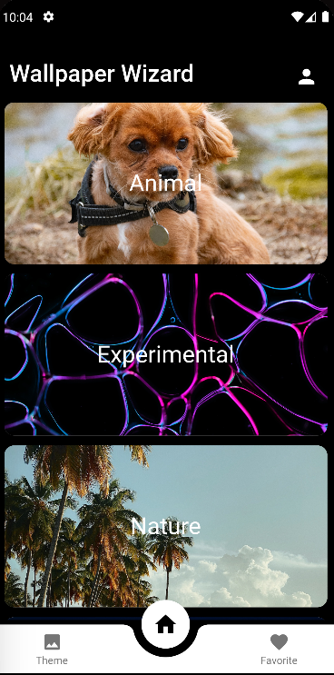
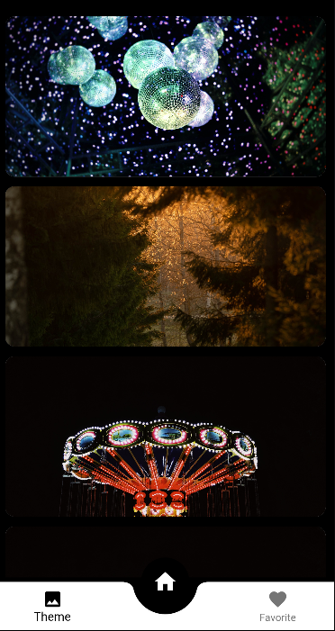
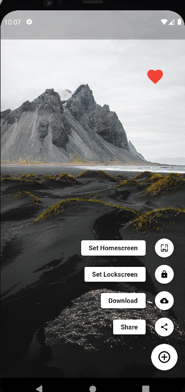
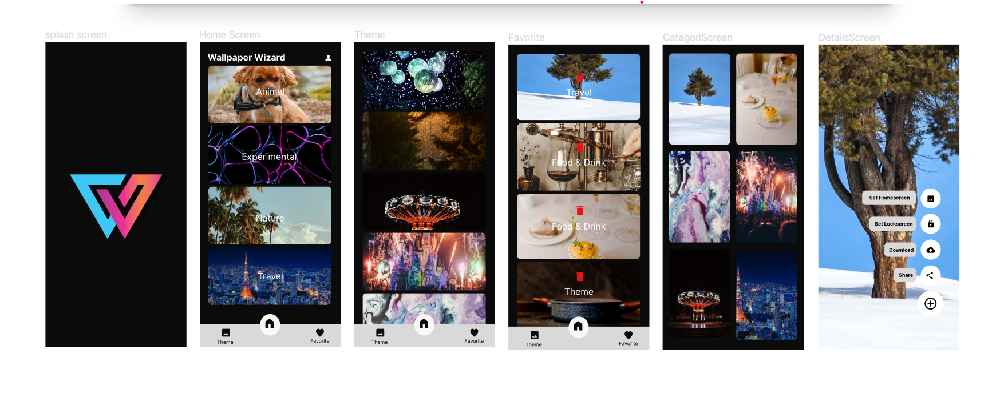

<p align="center"> 
  <tr>
     <td></td>
  </tr>
  <h2 align="center">This is Wallpaper Wizard App<h2>
 </p>
 
## Development Setup
Clone the repository and run the following commands:
```
flutter pub get
flutter run
```
 
### flutter packages:
- cupertino_icons: ^1.0.2
- firebase_core: any
- cloud_firestore: any
- fluttertoast: any
- simple_speed_dial: any
- flutter_wallpaper_manager: any
- flutter_cache_manager: any
- image_downloader: any
- share_plus: any
- flutter_screenutil: any
- get: any
- carousel_slider: any
- firebase_storage: any
- font_awesome_flutter: any

## Screenshots
   
  
 
 
